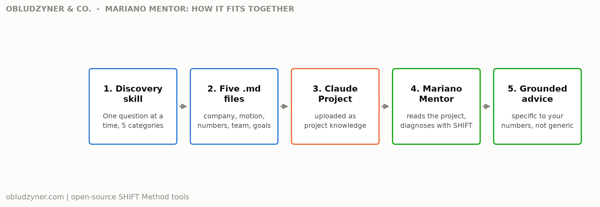

# Mariano Mentor (open-source edition)

An installable post-sales mentor for B2B SaaS founders and CEOs: a discovery skill that interviews you about your company, and a persona skill that gives you Mariano Obludzyner's direct, operator-level read on your post-sales decisions, grounded in your own numbers.

**Jump to:** [What you get](#what-you-get) | [Who this is for](#who-this-is-for) | [Why this project](#why-this-project) | [Worked example](#worked-example) | [How to set it up](#how-to-set-it-up) | [How this connects to Obludzyner and Co.](#how-this-connects-to-obludzyner-and-co)

Part of the same open-source series as [nrr-leak-diagnostic](https://github.com/marianoobludzyner-hub/nrr-leak-diagnostic), [renewal-risk-rollup](https://github.com/marianoobludzyner-hub/renewal-risk-rollup), and [call-proactivity-analyzer](https://github.com/marianoobludzyner-hub/call-proactivity-analyzer), by [Mariano Obludzyner](https://github.com/marianoobludzyner-hub), founder of Obludzyner & Co. Those three analyze data. This one is different in kind: it's an installable advisor, not a calculator.

  

## What you get

- **A discovery skill** - a structured, one-question-at-a-time interview about your company, your post-sales motion, your real numbers, your team, and your goals
- **Five synthesis files** - not a transcript, a consultant-style write-up of what was learned, ready to upload as Claude Project knowledge
- **A mentor skill** - once installed alongside those files, gives you Mariano's direct read on any post-sales decision, using his actual documented framework (Theory of Constraints, the SHIFT Method, the 5 pains), not generic AI advice
- **Grounded, not generic** - every diagnosis references your specific numbers and situation from the discovery files, not a template answer

## Who this is for

Founders and CEOs of B2B SaaS companies with no dedicated CS leader, or a very junior one, who want a sounding board for post-sales decisions between real conversations with an advisor. Also useful if you're evaluating whether Obludzyner & Co.'s SHIFT Method would actually fit your situation before booking a call.

## Why this project

Most AI "advisor" personas are a vibe, not a framework: confident tone, generic advice, no real diagnostic method underneath. This one is built the opposite way. The persona skill's principles, the SHIFT Method map, and the 5-pains diagnostic sequence are Mariano's actual documented framework, the same one behind every proof point in this GitHub. The discovery skill exists because advice without your real numbers is just a guess wearing a confident voice.

**The two-skill split is deliberate.** Discovery and mentorship are different jobs done by different mechanisms: discovery is a structured interview that ends in a synthesis (adapted from the discovery pattern Obludzyner & Co. uses internally to build client context before a Revenue Audit), and mentorship is a persona that channels a documented voice and framework the same way a domain-expert skill would. Bundling them into one skill would make both worse.

## Worked example

A synthetic company, Northwind Logistics, ran the discovery interview. The five resulting files are in [`examples/sample-context/`](examples/sample-context/). Here's how the mentor's advice changes when it's grounded in those files instead of a generic question:

See the full exchange in [`examples/sample-mentor-exchange.md`](examples/sample-mentor-exchange.md). Short version: asked "should I hire a second CSM," the mentor doesn't answer the headcount question directly. It traces the question back to what `numbers.md` actually shows (every figure is a founder estimate, not a tracked number), names the real gap as a measurement problem, not a staffing one, and gives one concrete move: audit the last 4 renewals for what was true 60 days out before deciding on a hire.

## How to set it up

1. **Run the discovery skill.** Drop the `discovery/` folder into your Claude Code or Claude Desktop skills directory, then ask: *"run the post-sales discovery."* Answer the questions, save the 5 files it gives you at the end.
2. **Create a Claude Project.** Name it something like "Mariano Mentor" or "[Your Company] Post-Sales Advisor."
3. **Upload the 5 files** from step 1 as that Project's knowledge.
4. **Add the `mentor/` skill** to the Project (or your Claude Code/Desktop skills directory if it applies project-wide).
5. **Ask it anything post-sales related.** *"Should I hire a CS lead?" "My NRR dropped, what do I look at first?" "A big account is escalating, how do I think about this?"*

No installation beyond that. Both skills are pure markdown instructions, no scripts, no dependencies.

Want to see the flow diagram regenerated, or build your own version? [`render_diagram.py`](render_diagram.py) is the optional matplotlib script that produced the image above (`pip install matplotlib`, then `python3 render_diagram.py`) - not required to use either skill.

## How this connects to Obludzyner and Co.

This is the open-source, self-serve shadow of what Obludzyner & Co. actually does: a Revenue Audit that starts with real discovery, not assumptions, and advice grounded in Theory of Constraints, not a generic playbook. The discovery pattern here is adapted from the exact interview structure used internally to build client context before a real engagement.

**What changes with a real engagement:** the mentor above can diagnose and point you in a direction, but it cannot look at your actual account-level data, align your leadership team, install playbooks with your team, or deploy AI infrastructure into your real workflow, that's the H, I, F, and T of the SHIFT Method, and none of them happen in a chat window. If the mentor's read on your situation lands, or if it surfaces something uncomfortable, that's exactly what a real Revenue Audit is for. [Start the diagnostic](https://obludzyner.com/diagnostic) or [book a conversation](https://obludzyner.com/#contact).

## What this is not

This is not Mariano, and it does not claim to be. It's a documented framework and a set of verified facts, applied to your specific situation by an LLM. It will not know something that isn't in the discovery files or wasn't verified when this skill was built, and it will tell you when a question needs a real Revenue Audit instead of a chat answer. Treat it as a sounding board, not a replacement for the real thing.

---

**Obludzyner & Co.** - Post-sales advisory for B2B SaaS. We install a commercial operating system that protects ARR and generates expansion in 90 days, without replacing your team or making you the bottleneck. [obludzyner.com](https://obludzyner.com) | [Start the diagnostic](https://obludzyner.com/diagnostic) | [Book a conversation](https://obludzyner.com/#contact) | [More open-source SHIFT Method tools](https://github.com/marianoobludzyner-hub)
